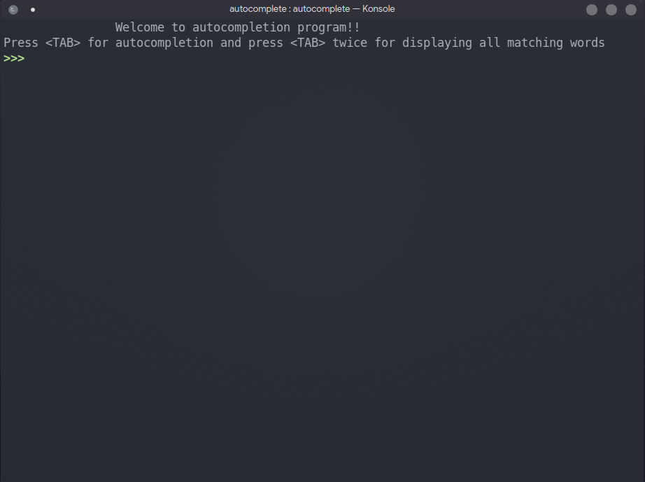

# Autocomplete



Autocompletion like in bash using Tries.

## Requirements
### Linux / macOS
* C++20
* GNU Readline

### Windows
* [Cygwin](https://www.cygwin.com/install.html)
* GNU Readline (install using cygwin)

## Usage
```shell
git clone https://github.com/ItIsUday/autocomplete.git
cd autocomplete
g++ *.cpp -o autocomplete -std=gnu++20 -lreadline
./autocomplete
```
